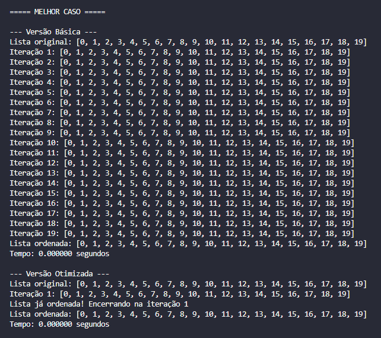

# 📚 Insertion Sort — Implementação e Otimização

## ✨ Descrição

Atividade prática da disciplina **Estrutura de Dados II**, com foco na implementação do algoritmo de ordenação **Insertion Sort**.  
Foram desenvolvidas duas versões:

- 🧱 **Básica** – algoritmo tradicional.
- ⚡ **Otimizada** – interrompe caso a lista já esteja ordenada durante as iterações.

---

## ⚙️ Como executar

1. Certifique-se de ter Python 3 instalado.
2. Execute o seguinte comando no terminal:

```
python test.py
```

---

## 🧪 Casos de Teste

Foram utilizados dois cenários clássicos para análise:

### ✅ Melhor Caso
Lista já ordenada: `[0, 1, 2, ..., 19]`

- A versão **básica** percorre todas as iterações sem realizar trocas.
- A versão **otimizada** detecta que não há necessidade de ordenação e encerra rapidamente.

📸 **Print:**



---

### 💀 Pior Caso
Lista em ordem inversa: `[19, 18, 17, ..., 0]`

- Ambas as versões realizam muitas movimentações.
- A otimizada segue até o fim pois há necessidade real de reordenar toda a estrutura.

📸 **Print:**


---

## 🧠 Análise dos Resultados

| Caso de Teste  | Versão Básica | Versão Otimizada |
|----------------|----------------|-------------------|
| Melhor Caso    | Percorre todas as posições, mesmo sem trocar | Interrompe na primeira iteração sem troca |
| Pior Caso      | Percorre e move todos os elementos | Sem ganho — comportamento igual à versão básica |

> ⚠️ **Conclusão:** a versão otimizada se destaca em listas que já estão (ou quase) ordenadas. Em listas muito desordenadas, o desempenho das duas versões é semelhante.

---

## 📁 Estrutura do Projeto

```
insertion-sort-atividade/
├── insertionsort.py         # Algoritmos básico e otimizado
├── test.py                  # Execução dos testes
├── screenshots/             # Imagens com os resultados
│   ├── MelhorCaso.PNG
│   └── PiorCaso.PNG
└── README.md
```

---

## ✍️ Autor

👤 Lucas Lemos — *Aluno de ADS (Estrutura de Dados II)*
